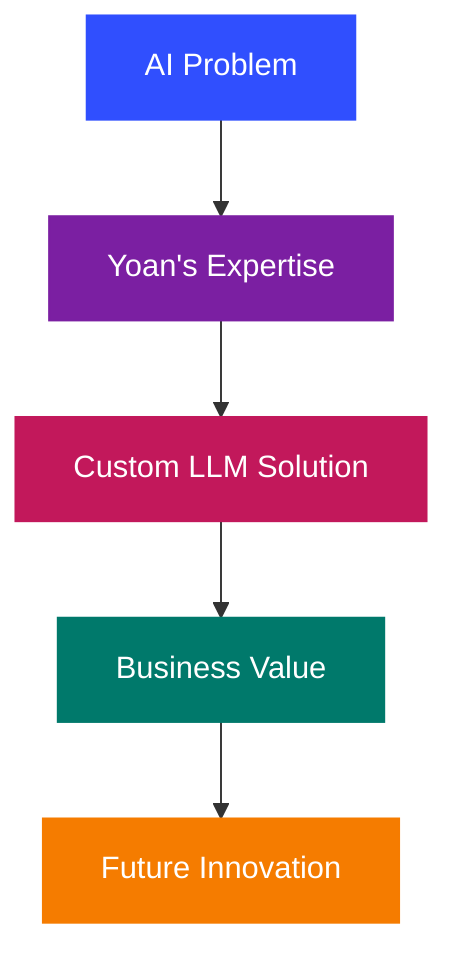

# Hi 👋, I'm Yoan Gabison
### AI Engineer | LLM Specialist | Tech Innovator

[](https://89p13.ai/)


```python
class YoanGabison:
    def __init__(self):
        self.name = "Yoan Gabison"
        self.education = "CentraleSupélec"
        self.specialization = "AI Engineering"
        self.skills = ["LLMs", "Langchain", "Langgraph", "FastAPI", "GenAI Solutions"]
        self.website = "https://89p13.ai"
    
    def mission(self):
        return "Turning complex tech into simple, elegant solutions 💡"
```
  
## 🧠 About Me

- 🎓 **Engineer from CentraleSupélec** specialized in AI
- 💼 **Freelance Tech Innovator** crafting cutting-edge Generative AI solutions
- 🌱 Building systems that empower businesses through **practical AI applications**
- ✍️ Sharing technical insights and industry trends on **LinkedIn**
- 🤝 Open to collaborations on projects involving LLMs, RAG, and AI agents

## 🛠️ Tech Stack


## 📌 Featured Projects
<a href="https://github.com/YoanGab/birdynfo_preview">
  
</a>
<a href="https://github.com/YoanGab/quickfind_preview">
  
</a>

<a href="https://github.com/YoanGab/langchain_chainlit">
  
</a>
<a href="https://github.com/YoanGab/chatbot_and_recommendation_system">
  
</a>

## 📊 GitHub Analytics


<p>
  
  
</p>

## 📫 Let's Connect

<a href="mailto:yoan@89p13.ai">
  
</a>
<a href="https://www.linkedin.com/in/yoangabison/">
  
</a>



</div>

<h2 align="center">🚀 Let's build the future of AI together!</h2>

<p align="center">
  
</p>
